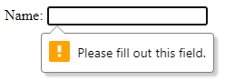
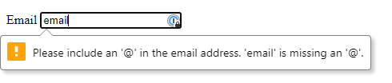

# HTML Forms

---

## The `<input />` tag

The `<input />` has a ton of types! The most common ones are:
- text (default)
- email
- password (hides the user's input)
- date

If no type property is set, it will default to `type="text"`. An `<input />` should **always** have a type!

--- 

## The `<input />` tag

The `<input />` tag also comes with a `required` property. This is a very quick and easy way to make sure that a form is not submitted with missing data.

When the `required` property is set on an `<input />` tag, the form will refuse to be submitted until the user fills in the input.



As a bonus, it can also enforce the type of data required!



---

## The `<label>` tag

The `<label>` tag usually accompanies the `<input />` tag. 

There are 2 ways of using the `<label>` tag:

```html
<!-- Method 1: One after the other -->
<label for="name">Name: </label>
<input type="text" id="name" name="name" required />

<!-- Method 2: Wrapped around -->
<label>
    Email
    <input type="email" id="email" name="email" required />
</label>
```

An `<input />` should **always** have a `<label>`!

---

## Linking a `<label>` to an `<input />`

To link a `<label>` to an `<input />` in the HTML, we have to set the `for` property on the `<label>` tag. 

The value of the `for` property **must match** the value of the `id` property on the `<input />` tag.

---

## Buttons

Forms usually come with buttons! Buttons only have 3 types:
- button (default)
- submit
- reset

If no type property is set, it will default to `type="button"`. A `<button>` should **always** have a type!

---

## Buttons in forms

When a button is inside a form, HTML automatically assumes it's sole purpose is to submit the form. 

This is not always the case, what if we want to clear the form? This is why we must always specify a type!

Typically we will give the button a `type="submit"` or `type="reset"` to clearly define it's purpose in the form.

---

## Handling forms

When handling a form event, we **ALWAYS** want to put the event listener on the `<form>` itself, not on the buttons inside the `<form>`.

A `<form>`'s default behavior is to _refresh the page_. This is something we want to **prevent** because refreshing is faster than submitting. If the page successfully refreshes, we lose all the data in the form!

Because of this fact, we must handle the `submit` event of the `<form>`, not the `click` event of the `<button>`.

---

## Validating forms

- Typically, forms are validated in the back-end (the server) for a few reasons.

- Security is one of the main reasons. You can't send all your data to someone's computer! You would be delivering all the information to them on a silver platter! 😱

- Processing is another reason. Even if your data wasn't sensitive and was just a bunch of food recipes for example, not everybody's computer is equipped to handle that kind of data processing. Maybe the user is on a really old machine. Or maybe they're using a phone. Sending that much information at once could cause harm to the user's machine!

- For today's workshop, we'll be doing our validating in the front-end because we won't cover back-end for a while. In the future, everything will happen on the back-end.
