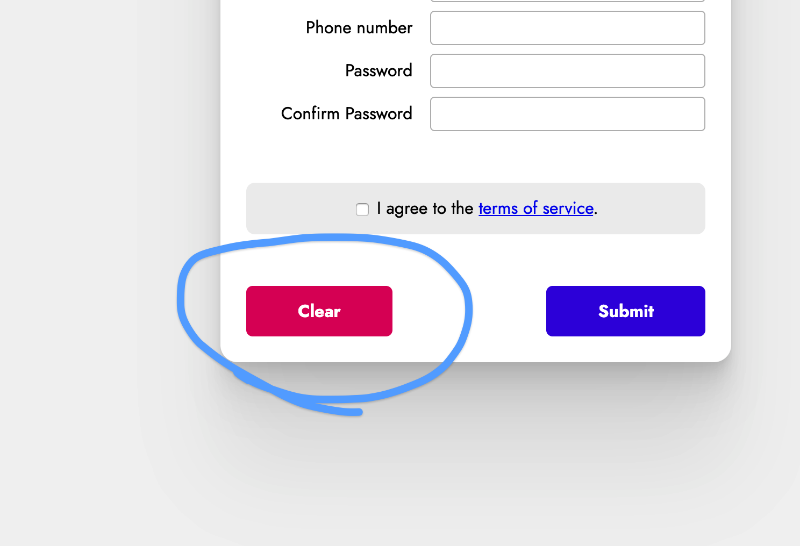

# Exercise 7 - The Clear Button

You'll notice in the design, there's a "clear" button:

When the user clicks this button, it should empty all individual text inputs, and untick the "I agree to terms" box.

Remove the `type` of the `button` and use JavaScript to make it clear the form instead!
